```{r setup, include=FALSE}
### html tags
##toc: true
##toc_float: true
### pdf tags
##includes:
##in_header: my-style.sty
knitr::opts_chunk$set(echo = TRUE,fig.align="center")
pdf <- TRUE
```


## The ascr package

The `ascr` ("acoustic spatial capture-recapture") package provides software implementation for the fitting of spatial capture-recapture models for acoustic data.

This manual details a user interface which may be used to fit these models. This application was developed in partnership with IUCN SSC primate specialist group section on small apes.

```{r pdf, echo = FALSE, eval = !pdf,results = 'asis',message = FALSE}
cat("A `.pdf` version is available [here](https://github.com/cmjt/ascr/blob/master/docs/index.pdf)")
```

```{r web, echo = FALSE, eval = pdf,results = 'asis',message = FALSE}
cat("An online manual is available [here](https://cmjt.github.io/ascr/).")
```

## Requirements

### Install R

`ascr` is an `R` package. Please ensure that you have the latest version of R installed.

Download `R` for [Windows](https://cran.r-project.org/bin/windows/base/)

Download `R` for [Linux](https://cran.r-project.org/)

Download `R` for [Mac](https://cran.r-project.org/bin/macosx/)

### Install `ascr` package


#### From `R`

`ascr` is an `R` package written by [Ben C. Stevenson](ben.stevenson@auckland.ac.nz), all source code is available [here](https://github.com/b-steve/ascr).

* To install simply run [this](https://raw.githubusercontent.com/b-steve/ascr/master/inst/scripts/install.r) script in `R`.

* To load the package run `library(ascr)`

* To test the ADMB executable follow instructions in this [README.md](https://github.com/b-steve/ascr)

### Launch `ascr` user interface


#### From `R`

Once the `ascr` package is installed then the user interface will open in your default browser by running

* `library(ascr)`, then

* `launch.ui()` in `R`.


## The `ascr` user interface

On launching the `ascr` you will be faced with an interactive web page, which will look like the screenshot below.

```{r, out.width = "100%",out.extra='style="background-color: #D3D3D3; padding:10px; display: inline-block;"',echo = FALSE,eval = !pdf}
knitr:::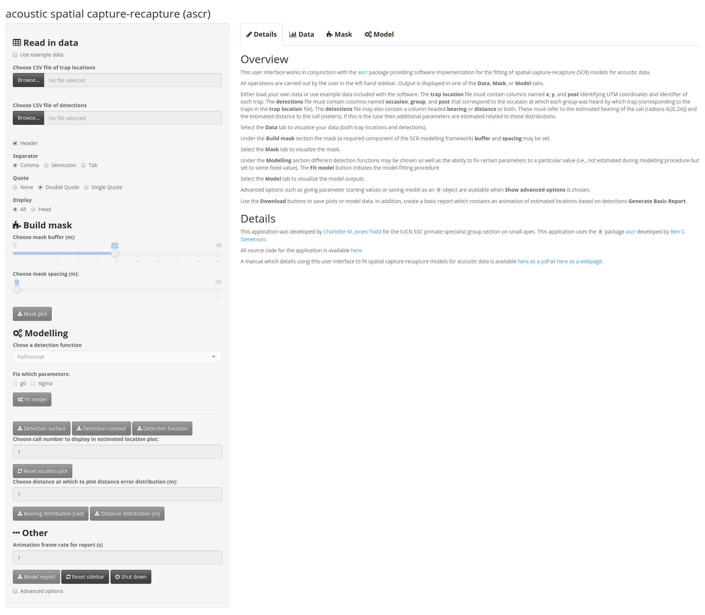
```


\begin{figure}
```{r, out.width = "100%", echo = FALSE,eval = pdf,echo = FALSE}
knitr:::
```
\end{figure}

All controls for the `ascr` user interface are situated in the left-hand sidebar. Content and modeling output is displayed in the main-panel. The layout of the sidebar and the main-panel is designed to lead the user through the required steps in fitting an acoustic spatial capture-recapture model (i.e., data, mask, model). 

A brief overview of the modelling requirements may be found on the **Details** tab of the interface. Output is displayed in one of the **Data**, **Mask**, or **Model** tabs. 

Further details regarding each of the modelling steps are given below. 

It should be noted that certain options in the sidebar will not be available to the user until the required preceding steps have been completed (e.g., one cannot fit a model without loading in data).

## Read in and inspect data

Either load your own data or use example data included with the software (as this manual does). The **trap location** file must contain columns named **x**, **y**, and **post** identifying UTM coordinates and identifier of each trap (currently only a single array of traps is supported). The **detections** file must contain columns named **occasion**, **group**, and **post** that correspond to the occasion at which each group was heard by which trap (corresponding to the traps in the **trap location** file). The **detections** file may also contain a column headed **bearing** or **distance** or both. These must refer to the estimated bearing of the call (radians $\in (0,2\pi)$) and the estimated distance to the call (meters). If this is the case then additional parameters are estimated related to these distributions.

```{r, out.width = "70%",out.extra='style="background-color: #D3D3D3; padding:10px; display: inline-block;"',echo = FALSE, eval = !pdf}
knitr:::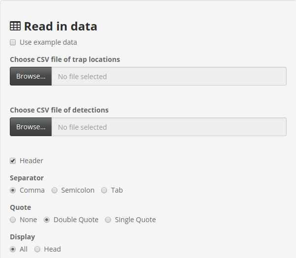
```

```{r, out.width = "70%",echo = FALSE, eval = pdf}
knitr:::
```

```{r, out.width = "70%",out.extra='style="background-color: #D3D3D3; padding:10px; display: inline-block;"',echo = FALSE, eval = !pdf}
knitr:::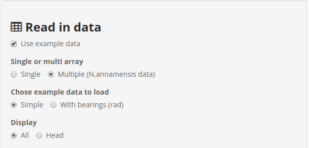
```

```{r, out.width = "40%",echo = FALSE, eval = pdf}
knitr:::
```


The example data included with the `ascr` package may be used by checking the ***Use example data**. Here use of the `ascr` user interface is demonstrated using example data that contains both **bearing** and **distance** measurements.

On selecting the **Data** tab your data will be displayed. It is important to check that the data is displayed correctly (i.e., imported in correctly from the `.csv` file). If this is not the case the sidebar has certain options that dictate how the `.csv` file format is understood

The **Traps** tab will show the raw data and automatically plot the position of the traps (recall the `ascr` package only currently supports modelling data from a single array). The locations of the traps are understood to be given by the **x** and **y** named columns of your data. In addition the traps should be identified by a column named **post**. 

```{r, out.width = "100%",out.extra='style="background-color: #D3D3D3; padding:10px; display: inline-block;"',echo = FALSE,eval = !pdf}

knitr:::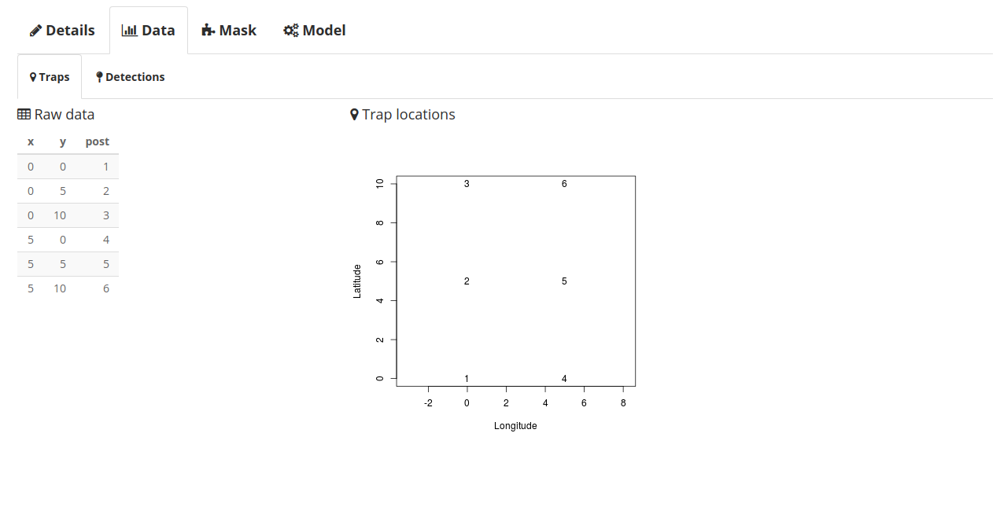
```
\begin{figure}
```{r, out.width = "100%",echo = FALSE,eval = pdf}

knitr:::
```
\end{figure}

The **Detections** tab will show the raw detection information and the constructed capture history matrix (the format `ascr` requires the data). The **detections** data must contain columns named **occasion**, **group**, and **post** that correspond to the occasion at which each group was heard by which trap (corresponding to the traps in the **trap location** data). The **detections** data may also contain a column headed **bearing** (rad) or **distance** (m) or both. These must refer to the estimated bearing of the call (radians $\in (0,2\pi)$) and the estimated distance to the call (meters). If this is the case then additional parameters are estimated related to these distributions.

```{r, out.width = "100%",out.extra='style="background-color: #D3D3D3; padding:10px; display: inline-block;"',echo = FALSE,eval = !pdf}
knitr:::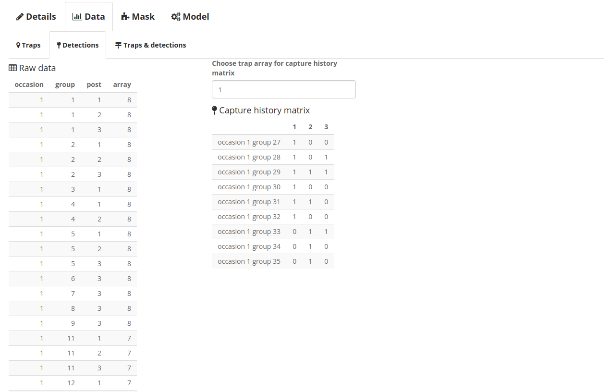
```
\begin{figure}
```{r, out.width = "100%",echo = FALSE,eval = pdf}
knitr:::
```
\end{figure}
## Constructing the mask

Acoustic spatial capture-recapture (ascr) (thus, of course spatially explicit capture-recapture (SECR)) modelling requires the use of a **mask**. The **mask** is a fine grid of coordinates around the trap locations which is used to provide a set of plausible locations for each detected call. 

The two choices to be made when constructing your mask are the **buffer** (m) and the **spacing** (m). These can be chosen using the sliders under the **Build mask** heading in the sidebar (see below).

The **buffer** (m) gives the maximum distance between each mask point and the closest trap. It should to be large enough so that the region it covers all plausible locations for the detected calls---this will depend on the species being detected (e.g., for a gibbon group this is $\sim$ 2km, whereas for a Western Cape moss frog this will be $\sim$ 40m).

The **spacing** (m) gives the distance between adjacent **mask** points. Thus, the smaller the **spacing** the finer the **mask** resolution and the greater the number of mask points. 

```{r, out.width = "70%",out.extra='style="background-color: #D3D3D3; padding:10px; display: inline-block;"',echo = FALSE,eval = !pdf}
knitr:::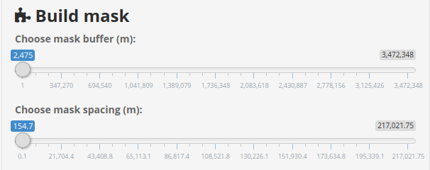
```

```{r, out.width = "70%",echo = FALSE,eval = pdf}
knitr:::
```

Select the **Mask** tab to visualize the mask and asses if you think the **buffer** zone and **spacing** are appropriate. 

```{r, out.width = "100%",out.extra='style="background-color: #D3D3D3; padding:10px; display: inline-block;"',echo = FALSE,eval = !pdf}
knitr:::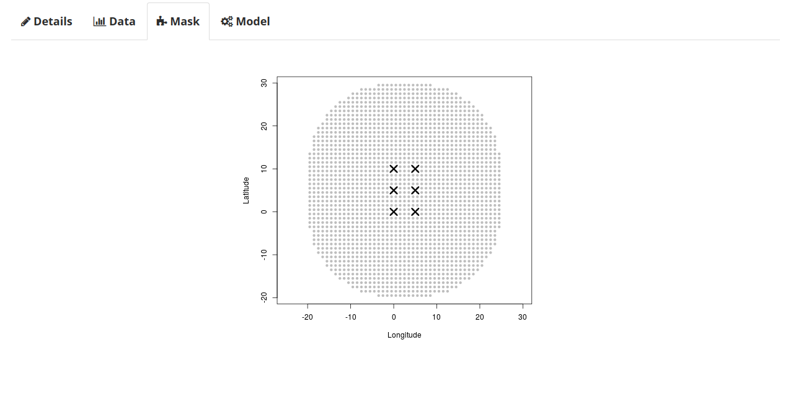
```
\begin{figure}
```{r, out.width = "100%",echo = FALSE,eval = pdf}
knitr:::
```
\end{figure}

## Model data

### Detection function

The **Modelling** section of the sidebar allows the user to choose one of three detection functions:

* halfnormal---$g(d;g0,\sigma) = g0 \; \text{exp}( \frac{-d^2} {2 \; \sigma^2 })$;

* hazard-rate---$g(d;g0,\sigma,z) = g0 \; ( 1 - \text{exp}( -\frac{d}{\sigma}^{-z} ))$;

* threshold---$g(d;\text{shape},\text{scale}) = 0.5 - 0.5 \; erf( \frac{d}{\text{scale}} - \text{shape})$.

Occasionally the you may want to fix a particular parameter, to do so check the corresponding check-box and and choose the value at which to fix. The image below shows the parameter g0 fixed an $1$ for the halfnormal distribution. Advanced model fitting options are available under the **Other** (Advanced options) section and include selecting parameter starting values. Further details are given below.

Once you are happy with the **mask** and detection function clicking the **Fit model** button will initiate model fitting. 


```{r, out.width = "70%",out.extra='style="background-color: #D3D3D3; padding:10px; display: inline-block;"',echo = FALSE, eval = !pdf}
knitr:::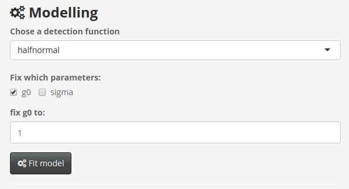
```

```{r, out.width = "70%", echo = FALSE, eval = pdf}
knitr:::
```

### Model output

The **Model** (**Output**) tab will show the parameter estimates of the model and other model outputs. If the data provided includes one or both of **bearing** or **distance** columns the model will includes this information in the model fitting. Therefore if you **do not** want to include this information import a file that does not include these data.

As illustrated by the image below a table of parameter estimates is displayed. The parameters estimated will depend on the form of detection function chosen and the parameters fixed (i.e., here g0 is not estimated as it has been fixed to 1). Estimated parameters will always include:

* D---group density per hectare.

Other parameters may include:

* g0---intercept for either the halfnormal or hazard-rate detection function,

* $\sigma$---scale parameter for either the halfnormal or hazard-rate detection function,

* z---shape parameter of the hazard-rate detection function,

* shape---shape parameter of the threshold detection function,

* scale---scale parameter of the threshold detection function,

* $\kappa$---concentration parameter of the bearings measurement error distribution (von Mises),

* $\alpha$---shape parameter of the distance measurement error distribution (gamma).

In all cases the model log-Likelihood value and the AIC score will be displayed as well as the estimated detection function and detection surface. The sidebar includes functionality to display the estimated location of a call and the distance at which to plot the distance measurement distribution (if distance data is provided). By default these values are call 1 and 1m respectively. If bearing data is provided the bearing measurement error distribution is also plotted---centered at 0. These plots will refresh once a new model is fitted (i.e., **Fit model** is activated). Each plot may be downloaded by using the appropriate buttons in the sidebar.


```{r, out.width = "100%",out.extra='style="background-color: #D3D3D3; padding:10px; display: inline-block;"',echo = FALSE, eval = !pdf}
knitr:::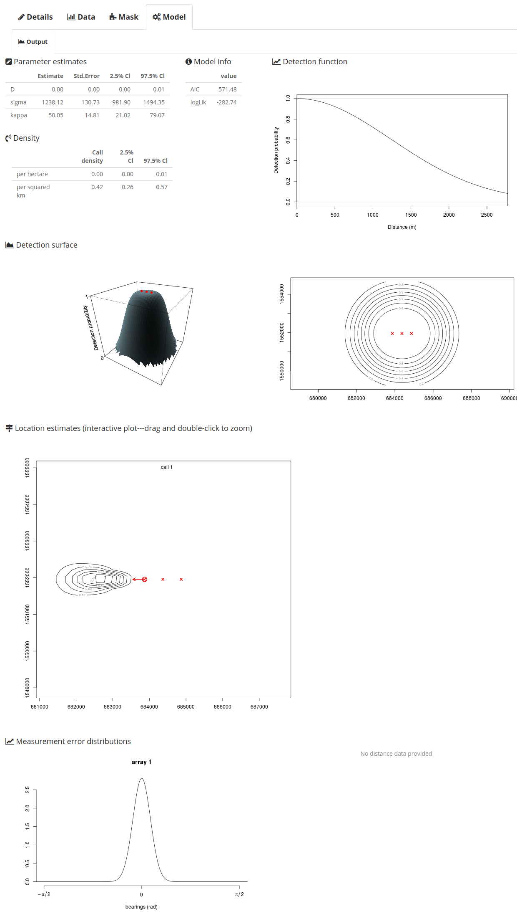
```
\begin{figure}
```{r, out.width = "100%",echo = FALSE, eval = pdf}
knitr:::
```
\end{figure}

One thing to note is the interactive nature of the **Location estimate** plot. This plot uses the model data to estimated the most probable location a call emanated from. If **bearing** and/or **distance** information is provided then these data are used to estimate the locations of the call. As both **bearing** and **distance** information is included in this example arrow direction and length represent the estimated **bearing** and **distance** of each call. The contours represent the area within which the call is estimated to have originated from.

As well as choosing a call number to display (see above) you may zoom in on areas of the **Location plot** (see below). To do so click and drag your pointer over the area you wish to inspect (center plot) and double-click to obtain a zoomed version (right hand plot). To reset the plot back to its original state use the appropriate button in the sidebar.

```{r, out.width = "100%",out.extra='style="background-color: #D3D3D3; padding:10px; display: inline-block;"',echo = FALSE, eval = !pdf}
knitr:::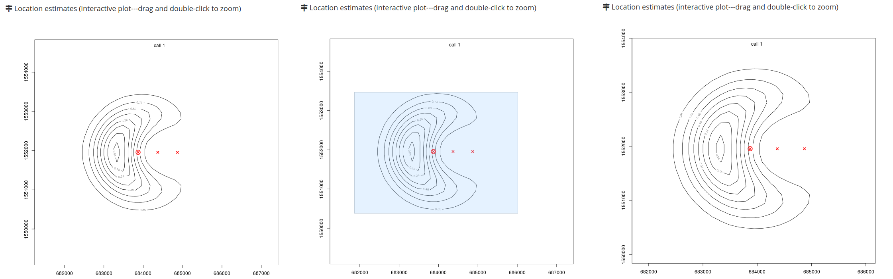
```
\begin{figure}
```{r, out.width = "100%", echo = FALSE, eval = pdf}
knitr:::
```
\end{figure}

## Other things to note

In addition to saving each of the plots resulting from **mask** construction and modelling a `.html` file may be downloaded, which contains data and model information (see **Model report** in the image). This includes an animation (see screenshot below) of the estimated call locations, the frame rate of which can be chosen (default is one per second). Note that this may take a few minutes and during the download the app will be disabled. 

```{r, out.width = "70%",out.extra='style="background-color: #D3D3D3; padding:10px; display: inline-block;"',echo = FALSE, eval = !pdf}
knitr:::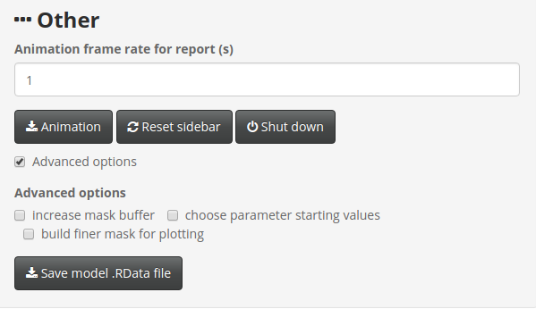
```

```{r, out.width = "70%", echo = FALSE, eval = pdf}
knitr:::
```


```{r, out.width = "100%",out.extra='style="background-color: #D3D3D3; padding:10px; display: inline-block;"',echo = FALSE, eval = !pdf}
knitr:::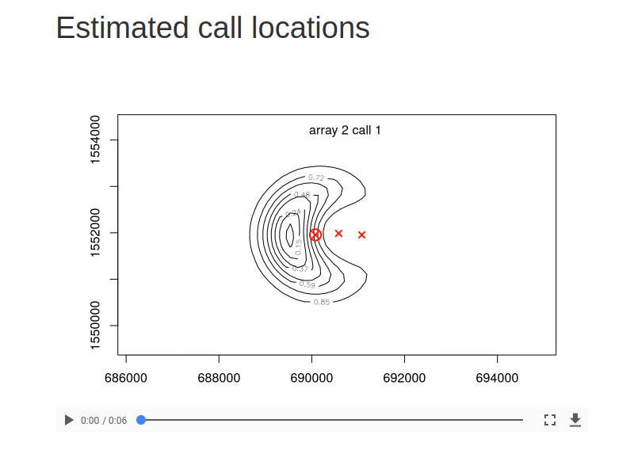
```
\begin{figure}
```{r, out.width = "100%",echo = FALSE, eval = pdf}
knitr:::
```
\end{figure}

### Advanced options

Other options of note are revealed upon checking the **Advanced options** check box. Here the user may,

* change bearings from degrees to bearings---if the app recognizes that bearings are in degrees not radians you will be prompted to check this option,

* increase the mask buffer size---the range of the mask buffer (m) slider is chosen based on the trap coordinates; however, occasionally the maximum may need to be increased (see below),

```{r, out.width = "70%",out.extra='style="background-color: #D3D3D3; padding:10px; display: inline-block;"',echo = FALSE, eval = !pdf}
knitr:::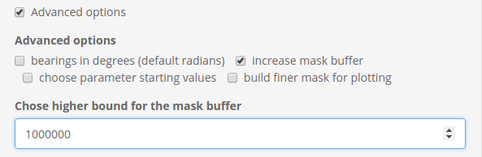
```

```{r, out.width = "70%",echo = FALSE, eval = pdf}
knitr:::
```

* chose parameter starting values---the `ascr` package will by default chose starting values for the optimization. However, upon occasion the optimizer will fail and a convergence error will be thrown. In this case typically defining more appropriate starting values will solve the convergence problems. Checking this box will allow you to set starting values for the parameters in the model (see below the value of 1 is chosen as a starting value for the parameter $\sigma$). Note---if a parameter is fixed (above) one clearly cannot provide a starting value.

```{r, out.width = "70%",out.extra='style="background-color: #D3D3D3; padding:10px; display: inline-block;"',echo = FALSE, eval = !pdf}
knitr:::include_graphics("ascr_sv.png")
```

```{r, out.width = "70%",echo = FALSE, eval = pdf}
knitr:::include_graphics("ascr_sv.png")
```

* build finer mask for plotting---to obtain smoother contours on the **Location estimate** plots a finer **spacing** (m) may be chosen. This will **only** affect the plotting and not the modelling.


```{r, out.width = "70%",out.extra='style="background-color: #D3D3D3; padding:10px; display: inline-block;"',echo = FALSE, eval = !pdf}
knitr:::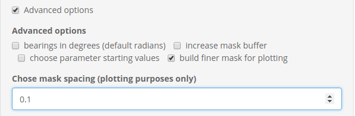
```

```{r, out.width = "70%",echo = FALSE, eval = pdf}
knitr:::
```